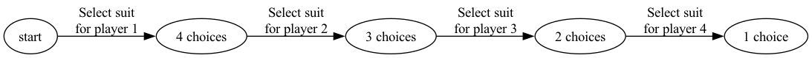
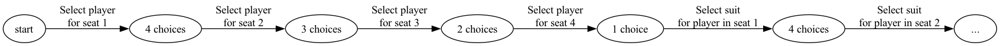

# 2025-10-06

## Uvod

O meni

* Prvic po slovensko
* Zadnjic, ko sem vodil vaje je bilo 2012, ko sem bil postdoc na Humboldt Uni v Berlinu, prej v Ameriki in v Angliji.
* Vmes sem delal v bancnistvu, pri Deutsche Bank kot Quantitative Analyst, statistische modellen, potem pa Allianz v Minchenu za 6 let, kjer sem vodil data science ekipe.
* Tudi sem delal za start-ups, sedaj pa vecinoma kot AI / data engineer kot freelancer.
* Ce vas zanima podrocje umetne inteligence, ali res aplikitivno matematiko, se lahko z veseljem govorimo.
* Kabinet je 5.12

Kako bo slo

* Ponavadi jaz eno vajo na tablici
* Potem pa v skupinah, nekdo predstavi resitev
* Najpre lazje vaje, vedno najman ena vaja, ki je tezka kot v kolloqviji

## Vaje za danes

Fokus auf kombinatorik. Na zacetku se bomo zaceli z 'diskretno verjetnost', ki pomeni, da gre za prozece, kjer se lahko samo končno število izidov zdogilo. Koliko jih je za razlicnih izidov je kombinatorik. Tudi v praksi, lahko predstavlja številne probleme s kontinuiranimi številkami kot končnimi izidi, tako da jih razvrsti v skupine ("binning").

### Definicije

Od https://math.dartmouth.edu/~prob/prob/prob.pdf

**permutacija ene mnozice A**: Naj bo A poljubna končna množica. Permutacija A je ena-na-ena preslikava
A na samo sebe.

**k-permutacija ene mnoznice A**: Naj bo A n-elementna množica in naj bo k celo število med 0 in n. Takrat je k-permutacja množice A urejen seznam podskupine množice A velikosti k.

### Formule

**razlicna med mozicami**

Ce ima $|A| = n$, $m = |B|$ in $B \subseteq A$, potem

$$
|A - B | = n - m
$$

**Kartezeski produkt mnozic**

Ce ima $|S_i| = n_i$,

$$
| S_1 \times \ldots \times S_k| = n_1 \cdot \ldots \cdot n_k
$$

**stevilo permutacij**

Ce $|S| = n$,

$$
|\{\sigma: S \rightarrow S \ bijective\}| = |S|! = n! = n \cdot (n-1)\cdot \ldots \cdot 1
$$

**stevilo izberov podmnozico velikosti k von n, neurejeno**

$$
{n \choose k} = \frac{n!}{k!(n-k)!}
$$

**permutacije z repeticije tipov**

če imamo $n$ elementov, da so $k_1$ enega tipa (tj. isti ponavljajoči se objekt), $k_2$ drugega tipa, ..., $k_l$ istega tipa (torej različnih tipov objektov),tako da
$n = k_1 + k_2 +···+ k_l$ potem obstaja

$$
\frac{n!}{k_1! k_2! \ldots k_l!}
$$

permutacij, ce dovolimo da se povavlja med vsako skupino.

tudi *multinomial coefficient*.

## Vprašanja / Questions

### Po Slovensko

### In English

Q: In card dealing questions, does the order of the players matter?
If so, how does that change the answers?

A: Typically in card dealing questions, the order of the players is considered unimportant.
You can see this in examples when the solution starts with a step like

Let's take the following small example.

**Example (only cards matter, not player)**: Suppose we have a standard deck of 52 cards with suits (card types) spades, hearts, clubs and diamonds, and four players. How many ways can we deal the cards, so that each player has all card of one suit?

We use our tree model as shown in the tutorials (which is just a pictorial representation of Cartesian product formula above) to represent that, if the order of players doesn't matter, we can pick any of the 4 to be the first. This player has 4 options for the entire hand to be of one suit, after which that suit has been used up, so that the 2nd player has 3 options to have a hand of one suit, and so forth.

From our tree model, we get the answer $4 \cdot 3 \cdot 2 \cdot 1 = 24$.

**Example (cards and player choice matter)**: In this non-standard question, the person posing the question has decided that the player order matters too, and that we want to know how many ways we can sit 4 players at 4 ordered seats, together with how many ways per seating configuration each player can get only cards of a single suit.

Our tree model representation would look like

Giving us $4! \cdot 4! = 576$ possibilities.