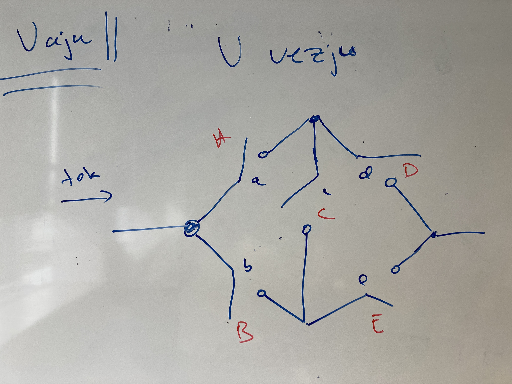

# Vaje, 2025-10-20

During the problem session we started but did not finish the following problem, which is taken from (a slightly different version of Martin Raič's [REŠENE NALOGE IZ VERJETNOSTI
IN STATISTIKE](http://valjhun.fmf.uni-lj.si/~raicm/Poucevanje/Verj/VRS_vaje.pdf), problem 24 on page 16, with solution on page 170.

## Solution

Let the circuit be

and define the events $A = \{\mathrm{Event\,that\,current\,passes\,through\,circuit\,at\,location\,a}\}$, and so forth.

Let $V$ be the event that current passes through the circuit from left to right. Recall from class that $P(A) = 1/3 = P(B) = \ldots = P(E)$, and that the events $A, \ldots, E$ are independent.

We use the law of total probability, conditioning on the event $C$ that current passes through the switch at $c$:

$$
P(V) = P(V | C) \cdot P(C) + P( V | C^c) \cdot P(C^c) \\
= 1/3 \cdot P(V | C) + 2/3 \cdot P(V | C^c)
$$

and consider each conditional probability separately. If $c$ lets current pass, then the relevant outcomes are

$AD$, $ACE$, $BCD$, $BE$. Given that $C$ occurs, these outcomes are the same as $(A\cup B) \cap (D \cup E)$, so

$$
P(V | C) = P( (A\cup B) \cap (D \cup E) | C). \
= P(A \cup B) \cdot P(C \cup E)
$$

since the outcomes are independent, hence so are events generated by them within their sigma algebra.

We use the [inclusion-exclusion formula](https://en.wikipedia.org/wiki/Inclusion–exclusion_principle) to get

$$
P(V | C) = (P(A) + P(B) - P(A\cap B)) \cdot (P(D) + P(E) - P(D \cap E)) \
= (1/3 + 1 /3 - 1/9)^2
$$

where we have used that $A,B$ are independent; same for $D, E$. Hence $P(V | C) = 25/81$.

Next we turn to $P(V | C^c)$. In this case no current is flowing at switch $c$, so current can flow through
the serial sub-circuits $AB$ or $BE$, which includes the case of flowing through both in parallel. Hence

$$
P(V | C^c) = P((A \cap D) \cup (B \cap E) | C^c) \
= P(A \cap D) + P(B \cap E) - P(A \cap B \cap D \cap E)
$$

by the independence of $C^c$ with the other variables plus the inclusion-exclusion formula. Again appealing to independence, we have

$$
P(V | C^c) = 1/9 + 1/9 - 1/81 = 17 / 81
$$

Combining, we obtain

$$
P(V) = 1/3 \cdot 25 / 81 + 2/3 \cdot 17/81 = 59 / 243.
$$